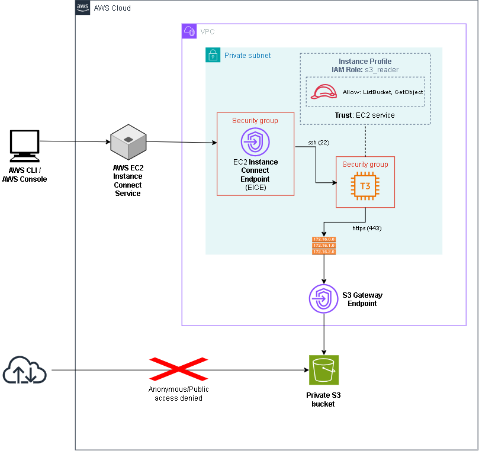

# Private EC2 Access to Amazon S3 with Terraform

This project provisions a private EC2 instance that can be reached without a
public IP address. Traffic from the EC2 instance to the private S3 bucket travels
through the private AWS network rather than the public internet.

It demonstrates two separate private connectivity mechanisms:

- EC2 Instance Connect Endpoint for SSH access to the private instance
- S3 Gateway Endpoint for private HTTPS traffic from the instance to Amazon S3

The EC2 instance receives temporary AWS credentials through an IAM Role and
Instance Profile. The role follows least privilege and allows only listing the
project bucket and reading its objects.



## Architecture

The infrastructure contains:

- One VPC using the `10.0.0.0/24` CIDR block
- One private subnet using the `10.0.0.32/27` CIDR block
- One private route table associated with an S3 Gateway Endpoint
- One Amazon Linux 2023 `t3.micro` EC2 instance without a public IP address
- One EC2 Instance Connect Endpoint in the private subnet
- One private S3 bucket with all public access blocked
  - with one test object named `test-file.txt`
- One IAM Role with `s3:ListBucket` and `s3:GetObject` permissions for the project bucket
- One Instance Profile that attaches the IAM Role to the EC2 instance
- Separate security groups for the EC2 instance and the EC2 Instance Connect
  Endpoint

SSH traffic follows this path:

```text
Local machine
    |
    | AWS CLI and EC2 Instance Connect
    v
EC2 Instance Connect Endpoint
    |
    | TCP/22
    v
Private EC2 instance
```

S3 traffic follows this path:

```text
Private EC2 instance
    |
    | HTTPS using temporary credentials from the Instance Profile
    v
S3 Gateway Endpoint
    |
    v
Private S3 bucket
```

## Security model

### SSH access

The security groups reference each other instead of allowing SSH from a CIDR
range:

- The EC2 Instance Connect Endpoint security group allows outbound TCP/22 only
  to the EC2 security group.
- The EC2 security group allows inbound TCP/22 only from the EC2 Instance
  Connect Endpoint security group.

The EC2 instance has no public IP address and does not require a locally managed
SSH key pair. The AWS identity used on the local machine must have permission to
connect through EC2 Instance Connect Endpoint.

### S3 access

The EC2 security group allows outbound TCP/443 only to the regional S3 prefix
list exposed by the Gateway Endpoint.

The IAM Role attached to the instance allows:

- `s3:ListBucket` on the project bucket
- `s3:GetObject` on objects in the project bucket

It intentionally does not allow `s3:PutObject`. The included validation script
confirms that reading succeeds while writing returns `AccessDenied`.

The Instance Profile does not contain permissions itself. It is the mechanism
that makes the IAM Role available to EC2. The instance retrieves temporary,
automatically rotated credentials from the EC2 Instance Metadata Service.

# How to use (Linux)

## Prerequisites

- An AWS Identity with permissions to create the resources used by this project and permissions to use the EC2 Instance Connect Endpoint (see [References](#references))
  - Do not use the AWS account root user
- Terraform `~> 1.15`
- AWS CLI v2
- OpenSSH
- An authenticated AWS CLI session

Verify the installed tools and the identity used for deployment:

```bash
terraform version
aws --version
ssh -V
aws sts get-caller-identity
```

## Deployment

### 1. Configure input variables

Copy the example file:

```bash
cp terraform.tfvars.example terraform.tfvars
```

Example configuration:

```hcl
region       = "eu-central-1"
project_name = "aws-private-s3-ec2-practice"
```

### 2. Initialize and validate Terraform

```bash
terraform init
terraform fmt -check
terraform validate
```

### 3. Review and apply the plan

```bash
terraform plan
terraform apply
```

### 4. Read the outputs

```bash
terraform output
```

Store the generated values for the following commands:

```bash
INSTANCE_ID="$(terraform output -raw ec2_instance_id)"
REGION="$(terraform output -raw aws_region)"

echo "$INSTANCE_ID"
echo "$REGION"
```

## Connecting to the private instance

Amazon Linux 2023 uses `ec2-user` as the default SSH user:

```bash
aws ec2-instance-connect ssh \
  --instance-id "$INSTANCE_ID" \
  --connection-type eice \
  --os-user ec2-user \
  --region "$REGION"
```

The connection is established through the EC2 Instance Connect Endpoint. The
instance remains private and does not receive a public IP address.

## Validating private S3 access

The user data attached to EC2 generates a validation script that checks
connectivity to S3.

Run the validation script:

```bash
/home/ec2-user/verify-s3-access.sh
```

The script verifies that:

1. AWS credentials are resolved from the EC2 IAM Role.
2. The instance can list the private bucket.
3. The instance can read `test-file.txt`.
4. The file contains `Hello from the private S3 bucket.`
5. An upload attempt fails with `AccessDenied`.

The final line should be:

```text
PASS: write access is denied
```

## Cleanup

First exit from the EC2 instance, then from local:

```bash
terraform destroy
```

# Potential improvements

- Add an S3 Gateway Endpoint policy restricted to the EC2 IAM Role and the
  project bucket. This is useful when multiple instances and IAM Roles share
  the same subnet.
- Improve the README to cover Windows machines as well.
- Store Terraform state in a versioned and encrypted S3 backend with state locking

# References

- [AWS: Introducing EC2 Instance Connect Endpoint](https://aws.amazon.com/blogs/compute/secure-connectivity-from-public-to-private-introducing-ec2-instance-connect-endpoint-june-13-2023/)
- [AWS: Permissions to use EC2 Instance Connect Endpoint](https://docs.aws.amazon.com/AWSEC2/latest/UserGuide/permissions-for-ec2-instance-connect-endpoint.html)
